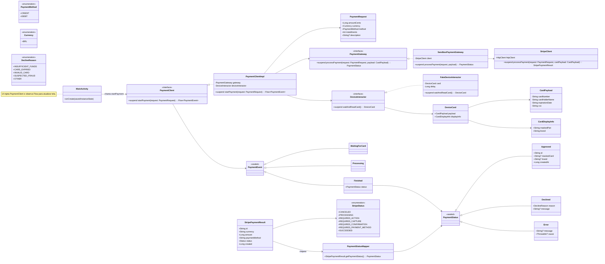

Diagrama das principais camadas e abstrações do app (`app`) e da SDK (`payment-sdk`), focando em como a UI consumiria o cliente de pagamentos exposto pela SDK.

```mermaid
classDiagram
    direction LR

    class MainActivity {
        +onCreate(savedInstanceState)
    }
    note for MainActivity "UI injeta PaymentClient e observa Flow<PaymentEvent> para atualizar tela."

    class PaymentClient {
        <<interface>>
        +suspend startPayment(request: PaymentRequest): Flow~PaymentEvent~
    }
    class PaymentClientImpl {
        -PaymentGateway gateway
        -DeviceInteractor deviceInteractor
        +suspend startPayment(request: PaymentRequest): Flow~PaymentEvent~
    }
    PaymentClient <|.. PaymentClientImpl
    MainActivity --> PaymentClient : chama startPayment

    class PaymentRequest {
        +Long amountCents
        +Currency currency
        +PaymentMethod method
        +Int installments
        +String? description
    }
    class PaymentMethod {
        <<enumeration>>
        +CREDIT
        +DEBIT
    }
    class Currency {
        <<enumeration>>
        +BRL
    }
    PaymentClientImpl --> PaymentRequest

    class PaymentEvent {
        <<sealed>>
    }
    class WaitingForCard
    class Processing
    class Finished {
        +PaymentStatus status
    }
    PaymentEvent <|-- WaitingForCard
    PaymentEvent <|-- Processing
    PaymentEvent <|-- Finished
    PaymentClient --> PaymentEvent

    class PaymentStatus {
        <<sealed>>
    }
    class Approved {
        +String id
        +String? maskedCard
        +String? brand
        +Long createdAt
    }
    class Declined {
        +DeclineReason reason
        +String? message
    }
    class Error {
        +String? message
        +Throwable? cause
    }
    class DeclineReason {
        <<enumeration>>
        +INSUFFICIENT_FUNDS
        +CARD_EXPIRED
        +INVALID_CARD
        +SUSPECTED_FRAUD
        +OTHER
    }
    PaymentStatus <|-- Approved
    PaymentStatus <|-- Declined
    PaymentStatus <|-- Error
    Finished --> PaymentStatus

    class PaymentGateway {
        <<interface>>
        +suspend processPayment(request: PaymentRequest, payload: CardPayload): PaymentStatus
    }
    class SandboxPaymentGateway {
        -StripeClient client
        +suspend processPayment(request, payload): PaymentStatus
    }
    PaymentGateway <|.. SandboxPaymentGateway
    PaymentClientImpl --> PaymentGateway

    class StripeClient {
        -HttpClient httpClient
        +suspend processPayment(request: PaymentRequest, cardPayload: CardPayload): StripePaymentResult
    }
    class StripePaymentResult {
        +String id
        +String currency
        +Long amount
        +String paymentMethod
        +Status status
        +Long created
    }
    class StripeStatus {
        <<enumeration>>
        +CANCELED
        +PROCESSING
        +REQUIRES_ACTION
        +REQUIRES_CAPTURE
        +REQUIRES_CONFIRMATION
        +REQUIRES_PAYMENT_METHOD
        +SUCCEEDED
    }
    StripePaymentResult --> StripeStatus
    SandboxPaymentGateway --> StripeClient

    class PaymentStatusMapper {
        +StripePaymentResult.getPaymentStatus(): PaymentStatus
    }
    StripePaymentResult --> PaymentStatusMapper : mapeia
    PaymentStatusMapper --> PaymentStatus

    class DeviceInteractor {
        <<interface>>
        +suspend waitAndReadCard(): DeviceCard
    }
    class FakeDeviceInteractor {
        -DeviceCard card
        -Long delay
        +suspend waitAndReadCard(): DeviceCard
    }
    DeviceInteractor <|.. FakeDeviceInteractor
    PaymentClientImpl --> DeviceInteractor

    class DeviceCard {
        +CardPayload payload
        +CardDisplayInfo displayInfo
    }
    class CardPayload {
        -String cardNumber
        -String cardHolderName
        -String expirationDate
        -String cvv
    }
    class CardDisplayInfo {
        +String maskedPan
        +String brand
    }
    DeviceInteractor --> DeviceCard
    DeviceCard --> CardPayload
    DeviceCard --> CardDisplayInfo
```
