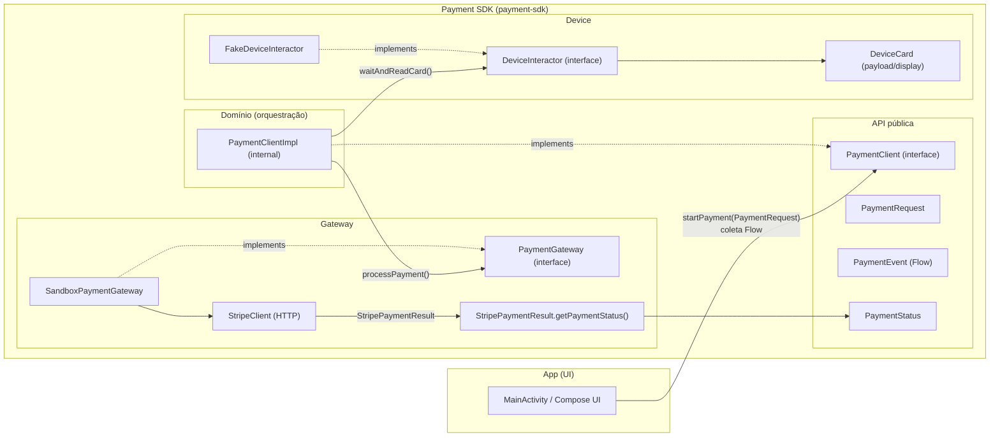

Visão de camadas e fronteiras entre o app (`app`) e a SDK (`payment-sdk`), destacando dependências e direção dos fluxos.

```mermaid
flowchart LR
    subgraph App["App (UI)"]
        MainActivity["MainActivity / Compose UI"]
    end

    subgraph SDK["Payment SDK (payment-sdk)"]
        direction TB

        subgraph API["API pública"]
            PaymentClient["PaymentClient (interface)"]
            PaymentRequest["PaymentRequest"]
            PaymentEvent["PaymentEvent (Flow)"]
            PaymentStatus["PaymentStatus"]
        end

        subgraph Domain["Domínio (orquestração)"]
            PaymentClientImpl["PaymentClientImpl (internal)"]
        end

        subgraph Device["Device"]
            DeviceInteractor["DeviceInteractor (interface)"]
            FakeDeviceInteractor["FakeDeviceInteractor"]
            DeviceCard["DeviceCard (payload/display)"]
        end

        subgraph Gateway["Gateway"]
            PaymentGateway["PaymentGateway (interface)"]
            SandboxPaymentGateway["SandboxPaymentGateway"]
            StripeClient["StripeClient (HTTP)"]
            PaymentStatusMapper["StripePaymentResult.getPaymentStatus()"]
        end
    end

    %% App -> SDK API
    MainActivity -->|"startPayment(PaymentRequest)\ncoleta Flow<PaymentEvent>"| PaymentClient

    %% API -> Domínio
    PaymentClientImpl -.implements.-> PaymentClient

    %% Domínio -> Device/Gateway
    PaymentClientImpl -->|"waitAndReadCard()"| DeviceInteractor
    DeviceInteractor --> DeviceCard
    FakeDeviceInteractor -.implements.-> DeviceInteractor

    PaymentClientImpl -->|"processPayment()"| PaymentGateway
    SandboxPaymentGateway -.implements.-> PaymentGateway

    %% Gateway chain
    SandboxPaymentGateway --> StripeClient
    StripeClient -->|"StripePaymentResult"| PaymentStatusMapper
    PaymentStatusMapper --> PaymentStatus
```
