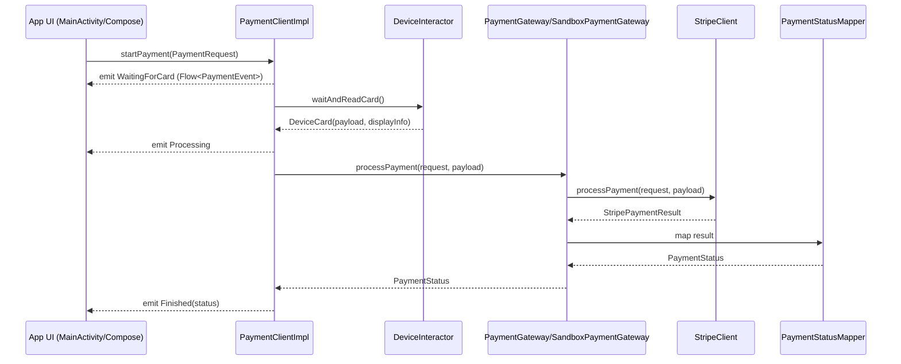

Sequência simplificada de um pagamento, mostrando como o app interage com a SDK, dispositivos e gateway.

```mermaid
sequenceDiagram
    participant UI as App UI (MainActivity/Compose)
    participant Client as PaymentClientImpl
    participant Device as DeviceInteractor
    participant Gateway as PaymentGateway/SandboxPaymentGateway
    participant Stripe as StripeClient
    participant Mapper as PaymentStatusMapper

    UI ->> Client: startPayment(PaymentRequest)
    Client -->> UI: emit WaitingForCard (Flow<PaymentEvent>)

    Client ->> Device: waitAndReadCard()
    Device -->> Client: DeviceCard(payload, displayInfo)

    Client -->> UI: emit Processing

    Client ->> Gateway: processPayment(request, payload)
    Gateway ->> Stripe: processPayment(request, payload)
    Stripe -->> Gateway: StripePaymentResult
    Gateway ->> Mapper: map result
    Mapper -->> Gateway: PaymentStatus
    Gateway -->> Client: PaymentStatus

    Client -->> UI: emit Finished(status)
```
